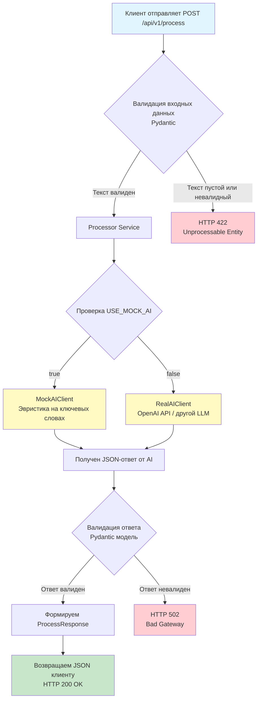
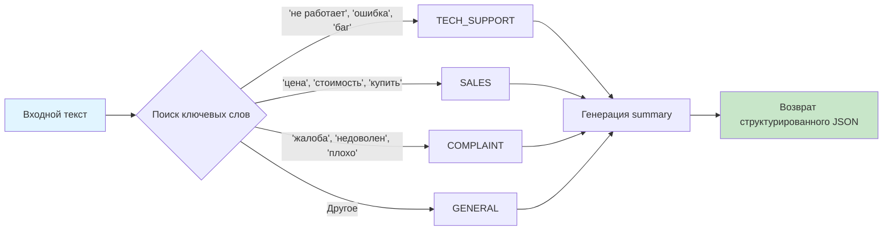
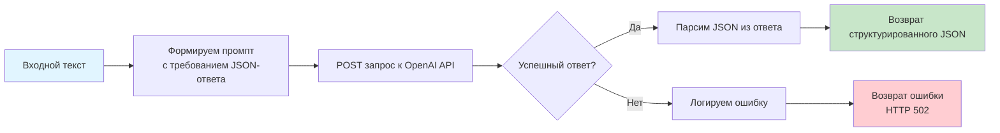
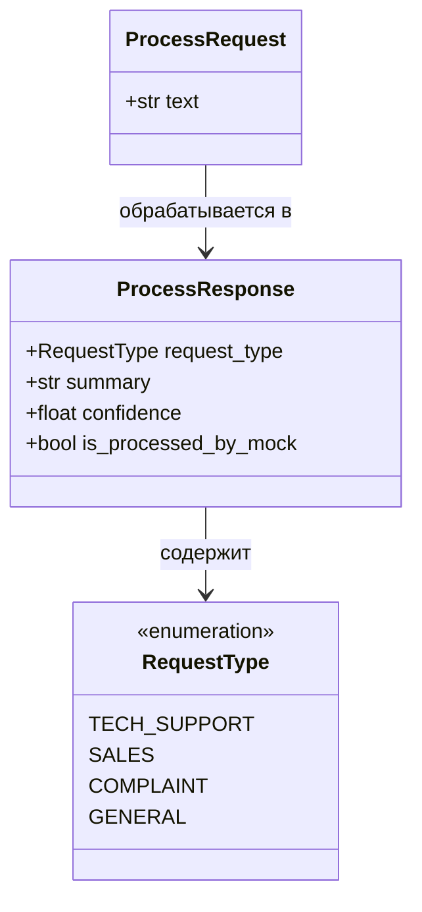
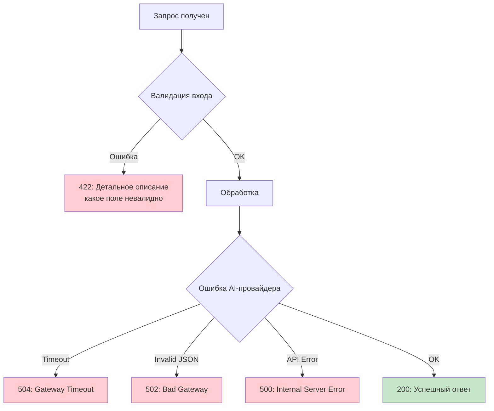

# Общая архитектура обработки запроса

```mermaid
flowchart TD
    A[Клиент отправляет POST /api/v1/process] --> B{Валидация входных данных<br/>Pydantic}
    
    B -->|Текст валиден| C[Processor Service]
    B -->|Текст пустой или невалидный| D[HTTP 422<br/>Unprocessable Entity]
    
    C --> E{Проверка USE_MOCK_AI}
    
    E -->|true| F[MockAIClient<br/>Эвристика на ключевых словах]
    E -->|false| G[RealAIClient<br/>OpenAI API / другой LLM]
    
    F --> H[Получен JSON-ответ от AI]
    G --> H
    
    H --> I{Валидация ответа<br/>Pydantic модель}
    
    I -->|Ответ валиден| J[Формируем ProcessResponse]
    I -->|Ответ невалиден| K[HTTP 502<br/>Bad Gateway]
    
    J --> L[Возвращаем JSON клиенту<br/>HTTP 200 OK]
    
    style A fill:#e1f5ff
    style L fill:#c8e6c9
    style D fill:#ffcdd2
    style K fill:#ffcdd2
    style F fill:#fff9c4
    style G fill:#fff9c4
```

# Детализация: MockAIClient

```mermaid
flowchart LR
    A[Входной текст] --> B{Поиск ключевых слов}
    
    B -->|'не работает', 'ошибка', 'баг'| C[TECH_SUPPORT]
    B -->|'цена', 'стоимость', 'купить'| D[SALES]
    B -->|'жалоба', 'недоволен', 'плохо'| E[COMPLAINT]
    B -->|Другое| F[GENERAL]
    
    C --> G[Генерация summary]
    D --> G
    E --> G
    F --> G
    
    G --> H[Возврат структурированного JSON]
    
    style A fill:#e1f5ff
    style H fill:#c8e6c9
```

## Детализация

```mermaid
flowchart LR
    A[Входной текст] --> B[Формируем промпт<br/>с требованием JSON-ответа]
    B --> C[POST запрос к OpenAI API]
    C --> D{Успешный ответ?}
    
    D -->|Да| E[Парсим JSON из ответа]
    D -->|Нет| F[Логируем ошибку]
    
    E --> G[Возврат структурированного JSON]
    F --> H[Возврат ошибки<br/>HTTP 502]
    
    style A fill:#e1f5ff
    style G fill:#c8e6c9
    style H fill:#ffcdd2
```

## Структура данных

```mermaid
classDiagram
    class ProcessRequest {
        +str text
    }
    
    class ProcessResponse {
        +RequestType request_type
        +str summary
        +float confidence
        +bool is_processed_by_mock
    }
    
    class RequestType {
        <<enumeration>>
        TECH_SUPPORT
        SALES
        COMPLAINT
        GENERAL
    }
    
    ProcessRequest --> ProcessResponse : обрабатывается в
    ProcessResponse --> RequestType : содержит
```

## Обработка ошибок

```mermaid
flowchart TD
    A[Запрос получен] --> B{Валидация входа}
    
    B -->|Ошибка| C[422: Детальное описание<br/>какое поле невалидно]
    
    B -->|OK| D[Обработка]
    
    D --> E{Ошибка AI-провайдера}
    
    E -->|Timeout| F[504: Gateway Timeout]
    E -->|Invalid JSON| G[502: Bad Gateway]
    E -->|API Error| H[500: Internal Server Error]
    
    E -->|OK| I[200: Успешный ответ]
    
    style C fill:#ffcdd2
    style F fill:#ffcdd2
    style G fill:#ffcdd2
    style H fill:#ffcdd2
    style I fill:#c8e6c9
```